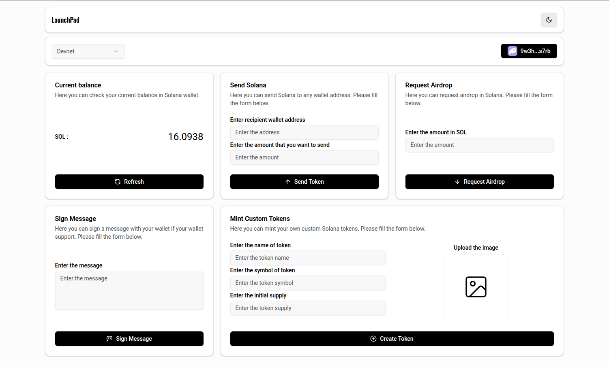

# Solana Launchpad

A modern Solana wallet and launchpad dApp built with React, Vite, and Solana Wallet Adapter.

---

##  Features
- Connect to Solana Mainnet, Devnet, or Testnet
- View wallet balance
- Request airdrop (on Devnet/Testnet)
- Send tokens
- Sign messages
- Beautiful, responsive UI

---

##  Installation

This project uses [Bun](https://bun.sh/) as the package manager and runtime.

### 1. Clone the repository
```sh
git clone <your-repo-url>
cd Solana-Launchpad
```

### 2. Install dependencies
```sh
bun install
```

### 3. Start the development server
```sh
bun run dev
```

The app will be available at [http://localhost:5173](http://localhost:5173) by default.

---

##  Environment Variables

Create a `.env` file in the root directory with the following variables:

```env
VITE_CLOUD_NAME=your_cloud_name
VITE_UPLOAD_PRESET=your_upload_preset
VITE_CLOUD_API_KEY=your_cloud_api_key
VITE_CLOUD_API_SECRET=your_cloud_api_secret
```

- `VITE_CLOUD_NAME`: Your Cloudinary cloud name
- `VITE_UPLOAD_PRESET`: Your Cloudinary upload preset
- `VITE_CLOUD_API_KEY`: Your Cloudinary API key
- `VITE_CLOUD_API_SECRET`: Your Cloudinary API secret


---

##  Screenshots




---

##  License

MIT LICENSE
